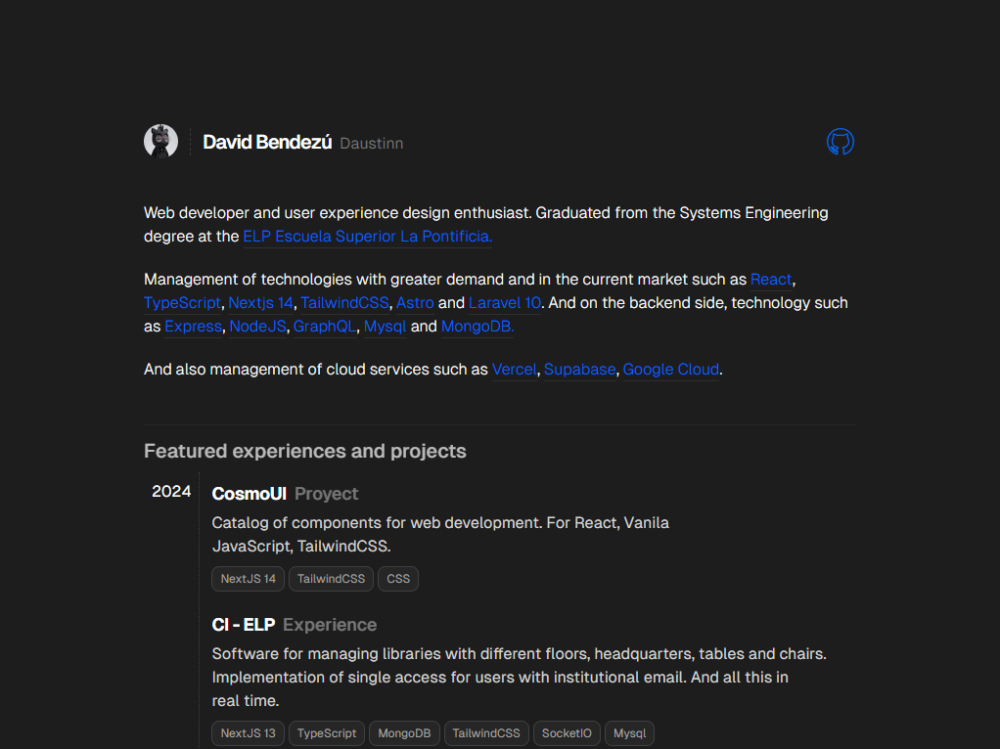

<div align="center">

<a href="https://www.pheralb.dev/" target="_blank">

</a>

</p>

<div align="center">
    <a href="https://daustinn.com" target="_blank">
        Website
    </a>
    <span>&nbsp;⁘&nbsp;</span>
    <a href="#-getting-started">
        Getting Started
    </a>
    <span>&nbsp;⁘&nbsp;</span>
    <a href="#-stack">
        Stack
    </a>
    <span>&nbsp;⁘&nbsp;</span>
    <a href="https://twitter.com/daustinndev" target="_blank">
        Twitter
    </a>
</div>

</p>

</div>

## ⚙ Stack

- [**Nextjs 14** + Typescript](https://nextjs.org/) - Build the web
  you want.
- [**Tailwind CSS**](https://tailwindcss.com/) - A utility-first CSS framework for rapidly building custom designs.
- [**Prettier** + prettier-plugin-tailwindcss](https://github.com/tailwindlabs/prettier-plugin-tailwindcss) - A Prettier plugin for Tailwind CSS that automatically sorts classes.

## 🚀 Getting Started

We recommend using the following extensions for Visual Studio Code:

- [**Tailwind CSS IntelliSense**](https://marketplace.visualstudio.com/items?itemName=bradlc.vscode-tailwindcss).
- [**PostCSS Language Support**](https://marketplace.visualstudio.com/items?itemName=csstools.postcss).
- [**Prettier - Code formatter**](https://marketplace.visualstudio.com/items?itemName=esbenp.prettier-vscode).

1. Clone the repository:

```bash
git@github.com:daustinn/website.git
```

2. Install dependencies:

```bash
npm install
# or
yarn install
# or
pnpm install
# or
ultra install
```

3. Run the development server:

```bash
npm next dev
# or
yarn dev
# or
pnpm next dev
# or
ultra dev
```

Open up [http://localhost:3000](http://localhost:3000) to view the website 🚀.

I am using [**Vercel**](https://vercel.com/) for deployment:

- [**daustinn.com**](https://daustinn.com).
- [**daustinn.vercel.app**](https://daustinn.vercel.app).
